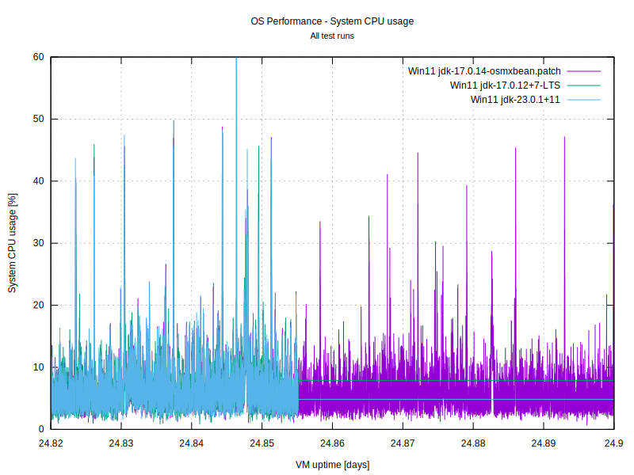

# OS performance logger to demonstrate JVM problem on Windows

## System and Java runtime information

The problem has been seen on Windows 11, 10 & Windows Server, but should be present on any Windows release.

Tested Java runtimes:
- OpenJDK 64-Bit Server VM Temurin-23.0.1+11 (build 23.0.1+11, mixed mode, sharing)
- OpenJDK 64-Bit Server VM Corretto-17.0.10.7.1 (build 17.0.10+7-LTS, mixed mode, sharing)

## Problem details

[`OperatingSystemMXBean`](https://docs.oracle.com/en/java/javase/23/docs/api/jdk.management/com/sun/management/OperatingSystemMXBean.html) stops reporting `cpuLoad` and `processCpuLoad` after 24.8 days JVM runtime

On Windows, a JVM that has run for more than 2,147,483.647 seconds (or `Integer.MAX_VALUE` milliseconds) will
no longer report any new values for `OperatingSystemMXBean::getCpuLoad` or `OperatingSystemMXBean::getProcessCpuLoad`.

The underlying native operating system implementation for Windows 
[OperatingSystemImpl.c#L997](https://github.com/openjdk/jdk/blob/master/src/jdk.management/windows/native/libmanagement_ext/OperatingSystemImpl.c#L997)
limits requests to avoid too frequent querying of system information. This implementation uses [`clock_t clock( void );`](https://learn.microsoft.com/en-us/cpp/c-runtime-library/reference/clock?view=msvc-170)
for tracking the `lastUpdate` time. To query new system information, at least 500 ticks must have passed since
the last query. Unfortunately the Windows clock() call is not suitable for long running processes. As stated
in the [documentation](https://learn.microsoft.com/en-us/cpp/c-runtime-library/reference/clock?view=msvc-170)

> Given enough time, the value returned by `clock` can exceed the maximum positive value of `clock_t`.
> When the process has run longer, the value returned by `clock` is always `(clock_t)(-1)`
> ...
> This macro gives a maximum clock function return value of 2147483.647 seconds, or about 24.8 days.

For the Windows implementation of `OperatingSystemImpl.c` this means that the 500 ticks between queries can 
no longer be fulfilled once the the `clock` call starts reporting `(clock_t)(-1)`. Thereafter, no new queries
will ever be made and the metrics will be stuck on the previous value that was retireved prior to `clock` 
exceeding the maximum positive value.

## The patch

I have forked and [patched](https://github.com/openjdk/jdk/commit/4486e38029a3247e39346d78715f47e39be5f020)
the JDK with a fix for this issue. For the Windows implementaion of `OperatingSystemImpl.c` the `clock()` call
is replaced with `_ftime()`. 

`_ftime()` provides time since epoch (with milliseconds) rather than the elapsed time since the process started. 
For limiting how often performance metrics may be retrived, this shall give the same behaviour as with `clock()`,
except that it continues working after 24.8 days (up until 23:59:59, December 31, 3000, UTC for the `_ftime64()`
implementation).

## Reproducing the issue

The issue can be reproduced and the patch can be seen to resolve the issue by using this simple OS performance
logger.

- Build `os-performance-logger` by running `mvn clean package`
- Log performance metrics to CSV file on Windows for 25 days with `java.exe -jar target/os-perf-logger-1.0-SNAPSHOT.jar metrics.csv`
- Visualize CSV result to verify that a non-patched JVM stops reporting performance metrics after 2,147,483.647 seconds
  

